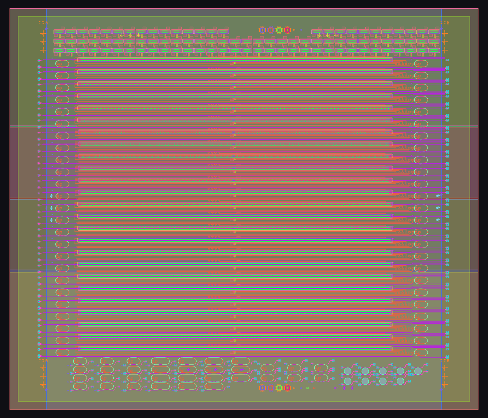

# linqs-layout

A fast, general layout engine for **large flattened DXF files**: a loader that
turns a giant layout into numpy in a few hundred milliseconds, a GPU viewer that
draws all of it at interactive framerates, and (next) design-rule checks (DRC).

On the reference file (`TOPO06.dxf`, 220 MB / 6.06 M vertices):

```
Parsed in 290 ms  (~760 MB/s)     # full geometry, not just a scan
Viewer: 6 M segments + 83 k circles uploaded once, redrawn every frame on the GPU
```

That's ~27× faster than a bare `awk` *counting* pass, and it materializes every
vertex, polyline, and circle into numpy arrays ready for geometric analysis.



## Layout of the project

```
dxfcore/dxf_parse.cpp   C++ core: mmap + single-pass parse -> Structure-of-Arrays
dxfcore/build.sh        builds libdxfcore.dylib with clang++
pydxf/loader.py         ctypes binding -> zero-copy numpy views + DxfLayout API
inspect_dxf.py          CLI: summarize a layout (counts, extent, per-layer table)
view_dxf.py             CLI: interactive GPU viewer / headless PNG render
viewer/                 moderngl scene + ortho camera + PySide6 window
```

## Quick start

```bash
bash dxfcore/build.sh            # build the native core once
python3 inspect_dxf.py TOPO06.dxf
python3 inspect_dxf.py TOPO06.dxf --json   # machine-readable
```

## Layout viewer

A GPU-accelerated viewer that renders the whole layout and stays interactive.

```bash
pip install -r requirements-viewer.txt
python3 view_dxf.py TOPO06.dxf                 # interactive window
python3 view_dxf.py TOPO06.dxf --png out.png   # headless render to PNG (no display)
```

* **scroll** to zoom in / out, centered on the cursor
* **left-drag** to pan
* **right-hand layer panel** — click a layer to show / hide it (`Show all` / `Hide all`)
* **R** to reset the view

How it stays fast: every polyline outline is flattened into a single `GL_LINES`
batch and every circle into one instanced draw, uploaded to the GPU once. Each
vertex carries only a layer id; the **vertex shader** looks up that layer's color
and visibility from small uniform arrays — so showing/hiding a layer is a one-float
uniform write with no buffer rebuild, and recoloring is free. The renderer
(`viewer/scene.py`) is context-agnostic: the same code drives the interactive
window and the headless `create_standalone_context()` PNG path used for tests.

```python
from pydxf import DxfLayout

doc = DxfLayout("TOPO06.dxf")
doc.n_polylines, doc.n_vertices, doc.n_circles   # 163447, 6058058, 83190
doc.layers                                       # ['BigChip', 'Chip1', ...]
doc.bbox()                                       # overall extent
doc.polyline(0)                                  # (n,2) float64 vertices, zero-copy
doc.layer_summary()                              # per-layer counts + bboxes
```

## Data model (validated against TOPO06.dxf)

The file is ASCII DXF R12 (`AC1009`): a strict stream of `(group-code, value)`
line pairs. This layout has only a `HEADER` + `ENTITIES` section — **no
BLOCKS/INSERT**, so geometry is fully flattened (no block transforms to resolve).
Two 2-D primitives appear:

- **POLYLINE** — closed polygons of straight segments (a `VERTEX` run terminated
  by `SEQEND`). No bulge (code 42), Z (30), or per-vertex width.
- **CIRCLE** — center + radius.

The loader exposes these as **Structure-of-Arrays** (cache-friendly, vectorizable):

| array | shape | meaning |
|---|---|---|
| `verts` | (N, 2) f64 | all polyline vertices, concatenated |
| `poly_start` / `poly_count` | (P,) | CSR slice of `verts` for each polyline |
| `poly_layer` | (P,) i32 | layer id per polyline |
| `poly_flags` | (P,) u8 | DXF code-70 flags (bit0 = closed) |
| `circ` | (C, 3) f64 | `[x, y, radius]` per circle |
| `circ_layer` | (C,) i32 | layer id per circle |
| `layers` | list[str] | layer names, indexed by layer id |

Arrays are **zero-copy views** over buffers owned by the C++ core; the `DxfLayout`
object keeps that memory alive and frees it on `close()` / GC. Use a `with` block
or call `.close()` when done with a huge file.

## Why it's fast

- `mmap` + `MADV_SEQUENTIAL`; no line-object allocation, no `iostream`.
- Single pass; group-code dispatch via a tiny state machine.
- Custom fixed-format float parser (`[-]ddd.dddd`) with `strtod` fallback.
- Output is SoA numpy with no Python-side per-entity objects.
- Handles the file's whitespace-padded group codes (a real gotcha — naive
  `code == "0"` matching silently undercounts).

## Next steps toward DRC

The SoA representation is the substrate for rule checks:

1. **Spatial index** per layer (`shapely.STRtree`, available) for neighbor queries.
2. **Width / spacing / enclosure / min-area** rules over polygons + circles.
3. **Inter-layer** rules (e.g. clearance between two layers).
4. Violation reporting with coordinates + an overlay viewer.
